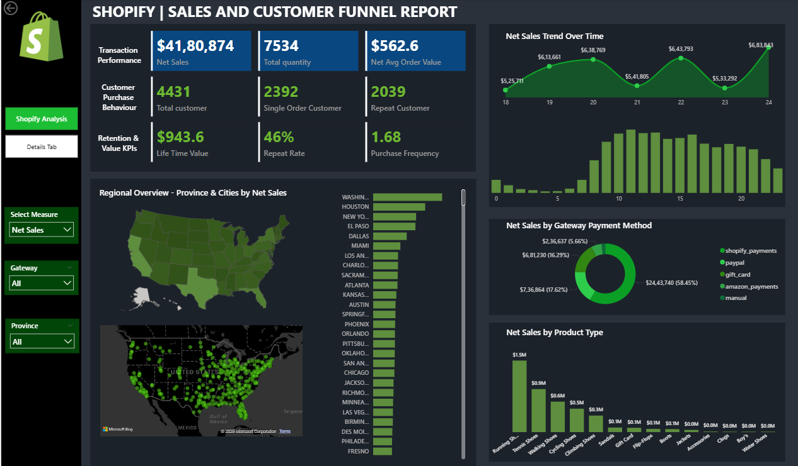
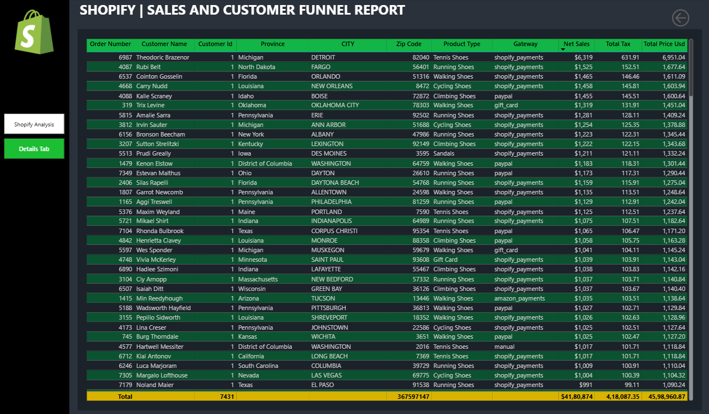

# Shopify Customer and Sales Analysis Dashboard

This project is a Power BI dashboard created to analyze Shopify sales, customer behavior, product performance, payment methods, regional sales trends, and transaction-level details using Shopify sales data.

The dashboard provides business insights through interactive visuals, KPI cards, maps, charts, filters, and a detailed transaction table.

---

## Project Overview

Shopify stores generate transactional data from customer orders, products, payment gateways, billing locations, taxes, and sales amounts.

This project uses Power BI to convert raw Shopify sales data into an interactive business intelligence dashboard. The dashboard helps users understand sales performance, customer behavior, retention metrics, product type performance, payment gateway usage, and regional sales distribution.

---

## Problem Statement

Raw Shopify sales data can be difficult to understand directly because it contains many order-level and customer-level fields.

The objective of this project is to build a Power BI dashboard that summarizes important Shopify sales and customer metrics in a clear and interactive way.

---

## Objectives

- Analyze Shopify sales transaction data
- Track net sales, total quantity, and average order value
- Analyze customer purchase behavior
- Identify single-order and repeat customers
- Track retention-related KPIs such as lifetime value, repeat rate, and purchase frequency
- Analyze regional sales by province and city
- Study sales trends over time
- Analyze sales by payment gateway
- Identify top-performing product types
- Provide detailed transaction-level records in a separate details tab

---

## Dataset

The dataset used in this project is:

```text
shopify_sales.xlsx
```

The dataset contains Shopify sales transaction records.

### Dataset Summary

| Item | Details |
|---|---|
| File Name | `shopify_sales.xlsx` |
| Sheet Name | `shopify_sales` |
| Rows | 7,431 |
| Columns | 19 |
| Date Range | March 18, 2025 to March 24, 2025 |
| Tool Used | Power BI |

---

## Dataset Columns

| Column | Description |
|---|---|
| Admin GraphQL API ID | Unique backend identifier used for Shopify records |
| Order Number | Unique order number assigned to each order |
| Billing Address Country | Customer billing country |
| Billing Address First Name | Customer first name |
| Billing Address Last Name | Customer last name |
| Billing Address Province | Customer billing province/state |
| Billing Address Zip | Customer billing ZIP code |
| CITY | Customer billing city |
| Currency | Transaction currency |
| Customer ID | Unique customer identifier |
| Invoice Date | Date and time of invoice/order |
| Gateway | Payment gateway used for transaction |
| Product ID | Unique product identifier |
| Product Type | Product category/type |
| Variant ID | Product variant identifier |
| Quantity | Number of units purchased |
| Subtotal Price | Price before tax or additional charges |
| Total Price USD | Final total price in USD |
| Total Tax | Tax amount applied to the order |

---

## Key Performance Indicators

The dashboard includes the following KPIs:

| KPI | Description |
|---|---|
| Net Sales | Total sales value after adjustments |
| Total Quantity | Total number of items sold |
| Net Average Order Value | Average value per order |
| Total Customers | Total number of unique customers |
| Single Order Customers | Customers who placed only one order |
| Repeat Customers | Customers who placed more than one order |
| Lifetime Value | Average customer value over time |
| Repeat Rate | Percentage of customers who made repeat purchases |
| Purchase Frequency | Average number of purchases per customer |

---

## Dashboard Pages

This Power BI report contains two main pages:

### 1. Shopify Analysis

The main dashboard page includes:

- Transaction performance KPIs
- Customer purchase behavior KPIs
- Retention and value KPIs
- Net sales trend over time
- Regional overview by province and city
- Net sales by payment gateway
- Net sales by product type
- Interactive filters for measure, gateway, and province

### 2. Details Tab

The details page contains transaction-level records, including:

- Order number
- Customer name
- Customer ID
- Province
- City
- ZIP code
- Product type
- Gateway
- Net sales
- Total tax
- Total price USD

---

## Dashboard Features

- Interactive Power BI dashboard
- KPI cards for sales and customer metrics
- Sales trend visualization
- Regional map-based analysis
- City-wise sales ranking
- Payment gateway analysis
- Product type sales analysis
- Detailed transaction table
- Filters and slicers for interactive exploration
- Dark theme dashboard design

---

## Tools Used

- Power BI
- Microsoft Excel
- Power Query
- DAX
- Data Visualization
- Business Intelligence

---

## Project Structure

```text
Shopify-Customer-and-Sales-Analysis-Dashboard/
│
├── README.md
├── .gitignore
│
├── data/
│   ├── README.md
│   └── shopify_sales.xlsx
│
├── dashboard/
│   ├── README.md
│   └── shopify_sales_dashboard.pbix
│
├── docs/
│   ├── README.md
│   └── shopify_data_terminology.docx
│
└── images/
    ├── README.md
    ├── dashboard_overview.png
    └── details_tab.png
```

---

## Dashboard Screenshots

### Dashboard Overview

This page provides a complete summary of Shopify sales and customer funnel performance. It includes transaction KPIs, customer behavior metrics, retention metrics, regional sales distribution, payment gateway analysis, product type sales, and net sales trend over time.



### Details Tab

This page provides detailed transaction-level records from the Shopify sales dataset. It allows users to review order details, customer information, product type, payment gateway, net sales, tax, and total price values.



---

## How to Use

### 1. Clone or download the repository

```bash
git clone https://github.com/Althafk7171/Shopify-Customer-and-Sales-Analysis-Dashboard.git
cd Shopify-Customer-and-Sales-Analysis-Dashboard
```

### 2. Open the Power BI dashboard

Open this file using Power BI Desktop:

```text
dashboard/shopify_sales_dashboard.pbix
```

### 3. Check the dataset path

Make sure the dataset is available here:

```text
data/shopify_sales.xlsx
```

If Power BI asks for the data source path, update the source path to the Excel file inside the `data` folder.

### 4. Refresh the dashboard

After updating the data source path, refresh the dashboard in Power BI.

---

## Insights

This dashboard helps answer business questions such as:

- What is the total net sales value?
- What is the total quantity sold?
- What is the average order value?
- How many total customers are there?
- How many customers are single-order customers?
- How many customers are repeat customers?
- What is the repeat rate?
- Which product types generate the highest sales?
- Which payment gateways contribute most to sales?
- Which cities and provinces generate the highest revenue?
- How does net sales change over time?

---

## Documentation

This project includes a data terminology document that explains important Shopify dataset fields such as order number, customer ID, invoice date, gateway, product type, quantity, subtotal price, total price USD, and total tax.

---

## Limitations

- The dashboard is based on the provided Shopify sales dataset only.
- The dataset covers a limited date range.
- Real-time Shopify API integration is not included.
- The dashboard depends on the structure of the provided Excel file.
- Customer-related fields are present in the dataset, so sensitive information should be handled carefully.
- The project is designed for dashboard and business intelligence practice.

---

## Future Scope

- Connect Power BI directly to Shopify API
- Add real-time data refresh
- Publish dashboard to Power BI Service
- Add advanced customer segmentation
- Add profit and margin analysis
- Include product inventory analysis
- Add forecasting for future sales
- Add drill-through pages for customer and product details
- Add role-based access for business users

---

## Contributor

- Muhammed Althaf K

---

## License

This project is developed for academic and learning purposes.

---
